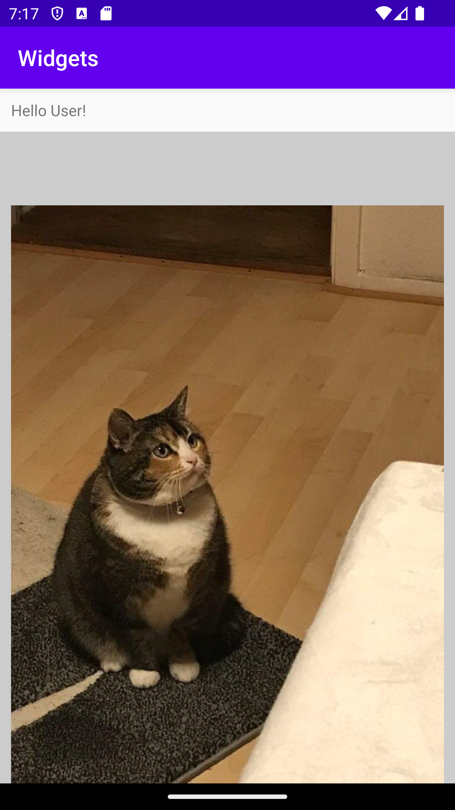

# Rapport

I started by changing the the base layout in activity_main.xml to a linear layout. After creating the layout I added three widgets, two text widgets and one image widget. In order to display
an image I added an image to the drawables folder and used it as a source for the imageview widget, written like this "android:src="@drawable/fatcat" />". Lastly I rearranged the widgets by nesting
them into two children layouts, both linear. The first text was put into the first layout which used a horizontal orientation, and the second text widget and the image was put into the second layer,
with the text widget being put below the image. The second widget was given a gray background.


## Följande grundsyn gäller dugga-svar:

- Ett kortfattat svar är att föredra. Svar som är längre än en sida text (skärmdumpar och programkod exkluderat) är onödigt långt.
- Svaret skall ha minst en snutt programkod.
- Svaret skall inkludera en kort övergripande förklarande text som redogör för vad respektive snutt programkod gör eller som svarar på annan teorifråga.
- Svaret skall ha minst en skärmdump. Skärmdumpar skall illustrera exekvering av relevant programkod. Eventuell text i skärmdumpar måste vara läsbar.
- I de fall detta efterfrågas, dela upp delar av ditt svar i för- och nackdelar. Dina för- respektive nackdelar skall vara i form av punktlistor med kortare stycken (3-4 meningar).

Programkod ska se ut som exemplet nedan. Koden måste vara korrekt indenterad då den blir lättare att läsa vilket gör det lättare att hitta syntaktiska fel.

```
    <LinearLayout
        android:layout_width="wrap_content"
        android:layout_height="wrap_content"
        android:orientation="horizontal">
    <TextView
        android:layout_width="wrap_content"
        android:layout_height="wrap_content"
        android:text="Hello User!"
        android:layout_margin="10dp" />
    </LinearLayout>

    <LinearLayout
        android:layout_width="wrap_content"
        android:layout_height="wrap_content"
        android:background="#CCCCCC"
        android:orientation="vertical">

        <ImageView
            android:layout_width="wrap_content"
            android:layout_height="635dp"
            android:layout_margin="10dp"
            android:contentDescription="fat cat"
            android:src="@drawable/fatcat" />

        <TextView
            android:layout_width="399dp"
            android:layout_height="wrap_content"
            android:layout_margin="10dp"
            android:text="Behold the kitty!"
            android:textAlignment="center" />
    </LinearLayout>
```

Bilder läggs i samma mapp som markdown-filen.



Läs gärna:

- Boulos, M.N.K., Warren, J., Gong, J. & Yue, P. (2010) Web GIS in practice VIII: HTML5 and the canvas element for interactive online mapping. International journal of health geographics 9, 14. Shin, Y. &
- Wunsche, B.C. (2013) A smartphone-based golf simulation exercise game for supporting arthritis patients. 2013 28th International Conference of Image and Vision Computing New Zealand (IVCNZ), IEEE, pp. 459–464.
- Wohlin, C., Runeson, P., Höst, M., Ohlsson, M.C., Regnell, B., Wesslén, A. (2012) Experimentation in Software Engineering, Berlin, Heidelberg: Springer Berlin Heidelberg.
